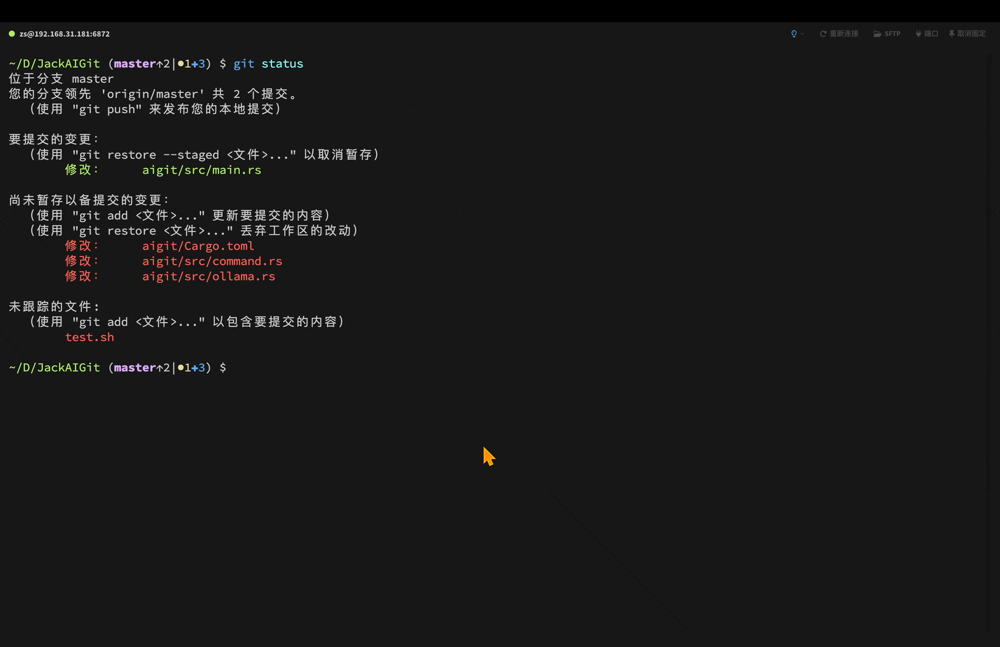

# AIgit

Reimagining Git Usage with AI

```
```text
Usage: aigit [OPTIONS] [COMMAND]

Commands:
  diff    Show the diff between the working tree and the index
  commit  Commit the current changes
  list    List all commits
  show    Show commit details
  help    Print this message or the help of the given subcommand(s)

Options:
  -p, --platforms  Show supported platforms
  -h, --help       Print help
  -V, --version    Print version
```
```
```

```
## Install

// please install rust first
./install.sh

## Test

./test.sh

## Demo


